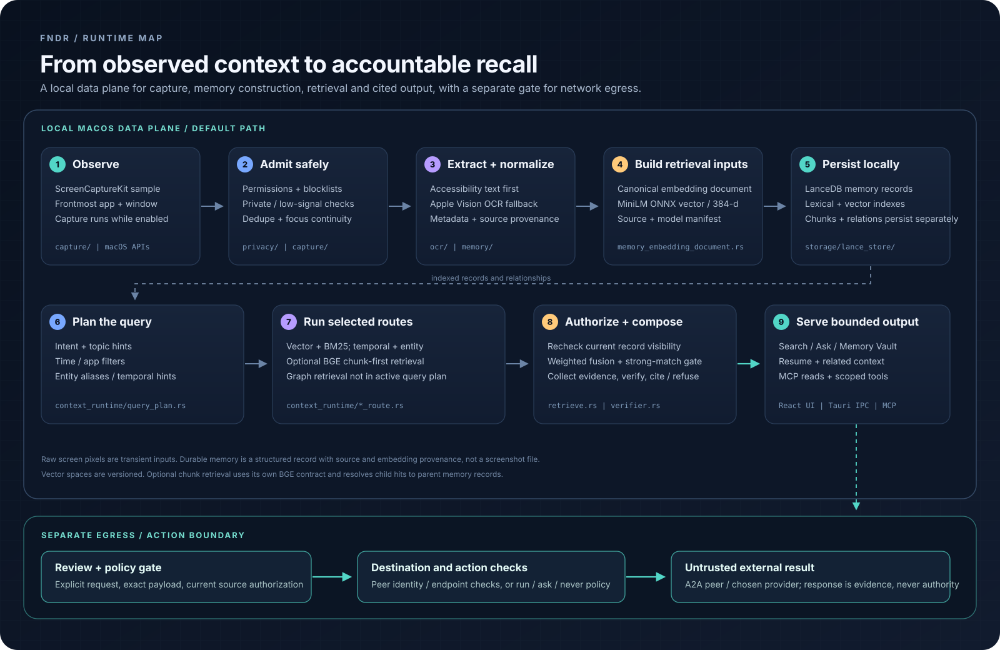
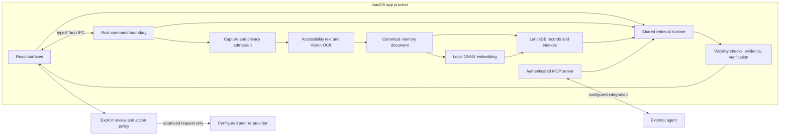
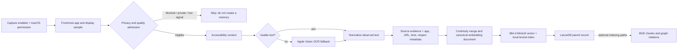
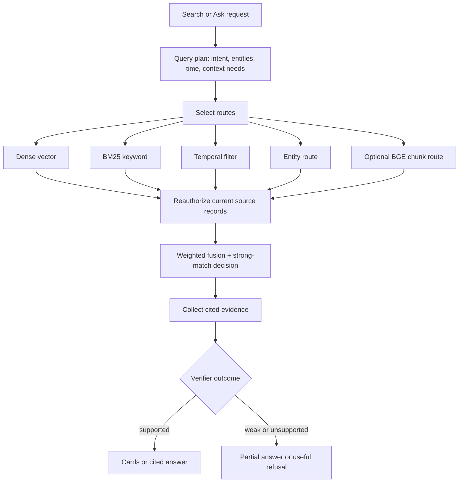
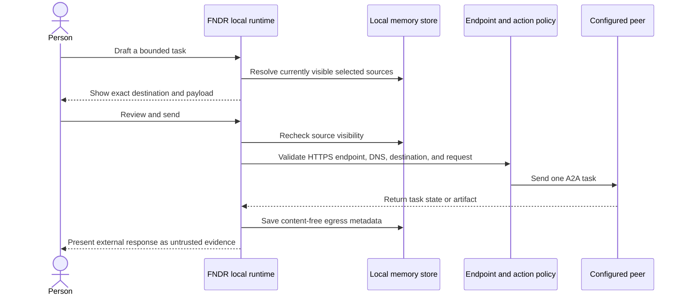

<p align="center">
  
</p>

<h1 align="center">FNDR</h1>

<p align="center">
  A local-first macOS memory system for finding and resuming work across apps.
</p>

<p align="center">
  <strong>React + TypeScript</strong> | <strong>Tauri 2</strong> | <strong>Rust</strong> | <strong>LanceDB</strong> | <strong>Apple Silicon</strong>
</p>

FNDR turns explicitly enabled desktop context into local, source-aware memory records. It combines native screen access, OCR and text cleanup, versioned local embeddings, lexical and semantic retrieval, evidence-grounded answers, and bounded integrations for agents. The durable product path is a structured memory index, not a screenshot archive.

> **Privacy boundary:** memory and indexes stay on the Mac by default. Network integrations are separate, configured paths. Outbound tasks and actions require their own user review and policy checks.

## System map

The diagram shows the active text-memory path and the boundary between local recall and external actions.

<p align="center">
  
</p>

## Runtime in one view



## Core paths, decomposed

### 1. Capture and memory construction



The admission and normalization stages are separate because a readable screen is not automatically a useful or permitted memory. Private and blocked contexts, FNDR's own windows, low-signal frames, and duplicate frames are filtered before they become ordinary records. Accessibility data is preferred where usable; Apple Vision provides OCR from the sampled display when needed.

The durable object is a `MemoryRecord` with text, time, app/window and source metadata, embedding provenance, and any supported reopen target. Screen pixels are transient capture inputs. New text extraction can preserve exact source statements with snapshot and line references; those statements are observations, not proof of speaker, intent, task status, or permission to act.

### 2. Record and index contracts

| Contract | Role | Runtime status |
|---|---|---|
| `MemoryRecord` | Parent record used for cards, context, citations, and reopen decisions | Primary durable memory |
| `MemoryEmbeddingDocument` | One canonical builder for primary, snippet, support, chunk-source, visual-semantic, and graph-node text | Source for role-specific embedding inputs and provenance |
| `MemoryChunkRecord` | Child text window with `parent_id` and its own BGE vector | Optional chunk-first retrieval; child hits resolve back to parent records |
| `raw_evidence.source_evidence` | Exact, bounded screen statements with source line and snapshot identity | Evidence for review and display; never action authority |
| `raw_evidence.embedding_manifest` | Input and vector-role provenance for embedding writes | Supports repair and contract audits |
| Graph nodes and edges | Typed, persisted relationships attached to source memories | Available to graph and browse surfaces; the active query planner does not select graph retrieval |

**Embedding contract.** The live durable parent table is `memories_v4_minilm_384`: `all-MiniLM-L6-v2`, ONNX Runtime, 384 dimensions. Model identity, tokenizer, dimension, and table are one contract. A vector from another model space cannot be written as if it belonged to this one.

The optional child table, `memory_chunks_v1_bge_1024`, uses BGE-large vectors and a separate BM25 path. The chunk route is disabled unless configured and usable chunk rows exist. It scores child text, rolls evidence up to its parent, and returns the parent record for presentation. Model candidates and reindex work do not become the active contract just because they compile or match a vector dimension.

### 3. Query planning, retrieval, and grounded output



Search, Ask, and connected read surfaces reuse the Rust retrieval runtime rather than inventing separate rankers. The planner selects vector and keyword routes, adding temporal and entity routes when the query has matching hints; chunk-first BGE retrieval is optional and requires its separate index. Persisted graph relations are available to graph and browse surfaces, but the active query planner does not select a graph retrieval route. The runtime checks current visibility before route scores are fused and again when evidence is assembled for an answer.

Fusion preserves the route reasons and matched terms that explain a hit. A separate `strong_match` decision prevents a ranked candidate from being presented as a confident answer merely because it was the best available result. The answer path collects bounded source evidence, verifies support, and returns citations or withholds unsupported claims. Card construction and answer composition remain separate outputs of the same retrieval evidence.

### 4. Reopen and resume

Reopen targets are evidence-backed metadata, not guesses from a summary. FNDR can retain browser URLs and text anchors, native document paths exposed by macOS Accessibility, app identifiers, and supported page positions. Before opening a file, the app checks that the path still exists and uses a typed result for success or fallback. Unsupported or missing targets remain explicit outcomes.

Related-memory links are persisted references with source identity. A deleted or currently excluded target is filtered at read time. A graph-derived relationship is presented as a path through recorded nodes and edges, not as a fact stated by the original screen.

## User and integration surfaces

| Surface | What it owns | Boundary |
|---|---|---|
| Search | Query filters, ranked memory hits, match reasons, open/reopen actions | Uses shared retrieval; weak matches remain visibly weak |
| Ask | Evidence collection, verification, cited answer or refusal | No unsupported completion claims |
| Memory Vault | Browse, inspect, and manage persisted memory records and relationships | Current visibility is checked for direct and nested reads |
| Home and Resume | Recent work context and supported return targets | Resume state is derived from currently visible records |
| To-dos and Daily Brief | Mutable tasks plus a deterministic brief composed from recent activity and open tasks | Briefing text is assembled in code without a generation model |
| Screen Guide | Explicit read-only question about the current display or a scoped filename lookup | Ephemeral turn; does not write ordinary memory or open a found file |
| Notch Do | Registered computer-use actions with local risk policy | Each action is classified to run, ask, or never; failures and stop states are explicit |
| MCP server | Authenticated read tools and separately gated write/action tools | Local, tunnel, and public modes have distinct network controls |
| A2A peer send | Person-reviewed task text and selected memory sources | Endpoint and source visibility are rechecked; peer output remains untrusted |

Voice is in migration: the Rust session manager and shared UI hook are present, while Search and Screen Guide still record through renderer-owned `MediaRecorder` flows. A unified cross-surface microphone lifecycle is not yet complete.

### Agent and action paths are not memory paths



MCP exposes local context to a connected client under bearer authentication and origin rules. Write-capable tools have additional settings and action gates. Peer sending follows a distinct path: the person reviews the exact payload; FNDR rebuilds it from currently authorized sources before egress; the remote result does not become a memory or authorize another action. Bearer-protected peers are refused until a peer-scoped credential binding exists.

Notch Do separates planning from execution. A request may be planned by an explicitly selected provider, but the Rust registry and risk policy decide which registered step may run, needs approval, or is never allowed. Captured screen text, web content, agent output, and peer artifacts are data to inspect, not instructions to follow.

## Runtime and module boundaries

| Layer | Main implementation | Responsibility |
|---|---|---|
| Desktop shell | `src/app/`, `src/domains/`, `src/shared/` | React surfaces, domain state, typed IPC wrappers, event subscriptions |
| Native boundary | `src-tauri/src/ipc/`, Tauri command registration | Permission-aware macOS operations and frontend/backend contract |
| Capture | `src-tauri/src/capture/`, `src-tauri/src/privacy/`, `src-tauri/src/ocr/` | Sampling, admission, OCR, normalization, dedupe, memory assembly |
| Embedding | `src-tauri/src/inference/`, `memory_embedding_document.rs` | Versioned text contracts, local ONNX sessions, canonical input provenance |
| Persistence | `src-tauri/src/storage/lance_store/`, `src-tauri/src/graph/` | LanceDB schemas, migrations, records, chunks, indexes, graph relations |
| Retrieval and answers | `src-tauri/src/context_runtime/`, `src-tauri/src/search/` | Query planning, route execution, access filtering, fusion, evidence, verification |
| Resume and actions | `src-tauri/src/operator/`, `src-tauri/src/agent/`, reopen commands | Typed targets, action policy, reviewed peer tasks, outcomes and activity records |
| Agent integration | `src-tauri/src/mcp/`, `src-tauri/src/agent/` | Authenticated MCP tools and person-reviewed outbound peer tasks |

Tauri commands are the native capability boundary. The renderer does not read the database or call macOS APIs directly. Backend status is pushed to the UI over typed events where the state is continuous; UI components do not need to poll native state independently.

Local model initialization and inference can block on filesystem, tokenizer, or native runtime work, so these jobs run outside Tokio's async executor. Shared ONNX sessions reuse the same model contract while per-caller batching and preprocessing remain local. Model residency is managed deliberately; a replaced handle is not evidence that native weights have been unloaded.

### Stack

| Concern | Technology |
|---|---|
| Desktop | Tauri 2, macOS native APIs, minimum macOS version 13 |
| UI | React 18, TypeScript, Vite |
| Backend | Rust 2021, Tokio, Serde, Specta-typed IPC |
| Local memory | LanceDB and Arrow schemas, versioned vector tables, local full-text indexes |
| Text embeddings | ONNX Runtime + Hugging Face tokenizer; MiniLM 384-d active contract |
| Optional local generation | `llama.cpp` through `llama-cpp-2` with Metal; model files are separate assets |
| Native screen path | ScreenCaptureKit, Apple Vision, Accessibility and AppKit |
| MCP transport | Axum, Streamable HTTP and supported SSE compatibility, bearer auth and origin controls |

## Privacy and evidence invariants

- Capture has an explicit enabled/paused state and macOS permission boundary.
- Private-context heuristics, app/site blocklists, FNDR's own process, low-signal checks, and dedupe act before a normal record is admitted.
- The normal memory path persists structured text and metadata, not the screen image. The debug-only Memory Journey has a separately bounded local artifact contract.
- Every derived read surface must authorize the current durable source records. Search filtering alone does not secure Vault, graph, timeline, MCP, activity, or aggregate projections.
- Source statements preserve what appeared on screen; summaries and model-selected fields do not promote that text into verified intent or permission.
- An embedding model, tokenizer, prefix, dimension, and table define one vector space. Reindexing is explicit and must retain rollback and old-data safety.
- Network access is visible and separately configured. MCP authentication, origin checks, action approval, endpoint validation, and content-free activity records protect different boundaries.

## Build and run

FNDR is a macOS application. A development build requires macOS 13 or later, Xcode Command Line Tools, Node.js with npm, and the Rust toolchain.

```bash
npm install
npm run tauri dev
```

On first run, onboarding obtains the required local embedding assets. macOS may request Screen Recording, Accessibility, or microphone permission for the enabled feature being used. Permission denial should leave an explicit unavailable state; it should not be represented as a successful capture or voice turn.

## Verification

```bash
make test
```

The default gate runs Python script tests, TypeScript typecheck, frontend tests, the production frontend build, and Rust tests. GitHub Actions runs the repository checks in separate workflows.

Retrieval changes also use the seeded synthetic-persona gate:

```bash
make qa-retrieval-check PERSONA=knowledge-worker
make qa-retrieval-check PERSONA=office-pm
make qa-retrieval-check PERSONA=software-engineer
```

The gate reseeds a disposable QA profile and compares per-surface results with accepted references. It is evidence about the labeled synthetic cases, not proof of native permissions, capture quality on every app, owner-vault usefulness, or participant outcomes. Native and human checks are reported separately. Never point a seeder or migration at the real profile to make a README claim.

## Repository map

```text
src/
  app/                         Shell, navigation and mounted product surfaces
  domains/                     Search, Vault, Home, settings and other UI domains
  shared/                      Typed IPC wrappers and shared UI primitives
src-tauri/src/
  capture/                     Screen sampling and memory assembly
  context_runtime/             Query planning, routes, fusion and answer evidence
  inference/                   Embedding and local generation runtimes
  ipc/                         Tauri command handlers and native API boundary
  mcp/                         MCP server, tools, resources, authorization
  operator/                    Registered local actions and risk policy
  storage/lance_store/         Local records, vector schemas and indexes
docs/
  architecture/                System maps and schema notes
  decisions/                   Accepted and proposed architecture decisions
  product/                     User-visible contracts and QA protocols
  evidence/                    Sanitized, dated validation artifacts
```

## Technical references

- [Architecture overview](docs/architecture/ARCHITECTURE.md)
- [Documentation index](docs/README.md)
- [Domain and data vocabulary](docs/CONTEXT.md)
- [MCP integration and setup](docs/mcp.md)
- [Agent surfaces](docs/agent.md)
- [Action policy](docs/product/actions-policy.md)
- [Memory Journey evidence contract](docs/product/memory-journey.md)
- [Quality Lab](docs/product/quality-lab.md)
- [October product plan](docs/team/2026-10-month-plan.md)
- [Change history](CHANGELOG.md)

## License

Source code is licensed under the [Apache License 2.0](LICENSE).
