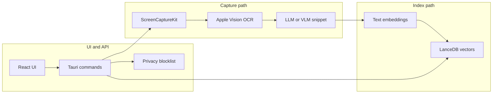

# FNDR architecture

Local-first memory retrieval: screen capture → text → embeddings → **LanceDB** → hybrid search → React UI, with privacy controls and typed **Tauri IPC**.

## Subsystems

| Layer | Role |
|-------|------|
| **Capture** (`src-tauri/src/capture/`) | Sample frontmost window; perceptual-hash dedupe; optional demo-only mode skips ingestion. |
| **OCR** (`src-tauri/src/ocr/`) | Vision framework text extraction (macOS). |
| **Inference** (`src-tauri/src/inference/`) | Local LLM summarization; optional VLM for richer snippets. |
| **Embed** (`src-tauri/src/embed/`) | Deterministic embedding vectors for hybrid search. |
| **Store** (`src-tauri/src/store/lance_store.rs`) | LanceDB table `memories`; stats, keyword + vector search. |
| **Search** (`src-tauri/src/search/`) | Combines vector + keyword results. |
| **Privacy** (`src-tauri/src/privacy/`) | App blocklist from config. |
| **IPC** (`src-tauri/src/api/commands.rs`) | `search`, `get_status`, `get_readiness`, demo commands, etc. |
| **Frontend** (`src/`) | Search, timeline, settings, readiness panel. |

## Demo / grading mode

- **Seeded data**: IDs prefixed with `fndr-demo-`; **Reset demo data** removes them.
- **`use_demo_data_only`**: capture loop does not add new rows; search still works on existing indexed content.
- **CLI** `--demo-data-only`: same as demo-only for the running process (also disables VLM for stability).
